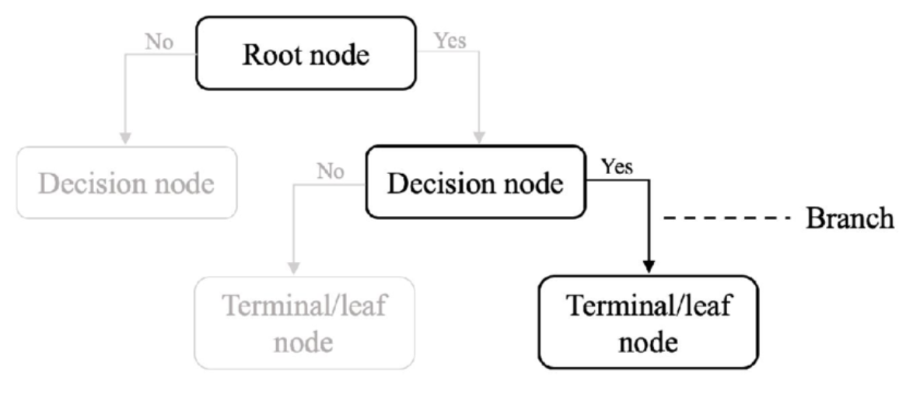
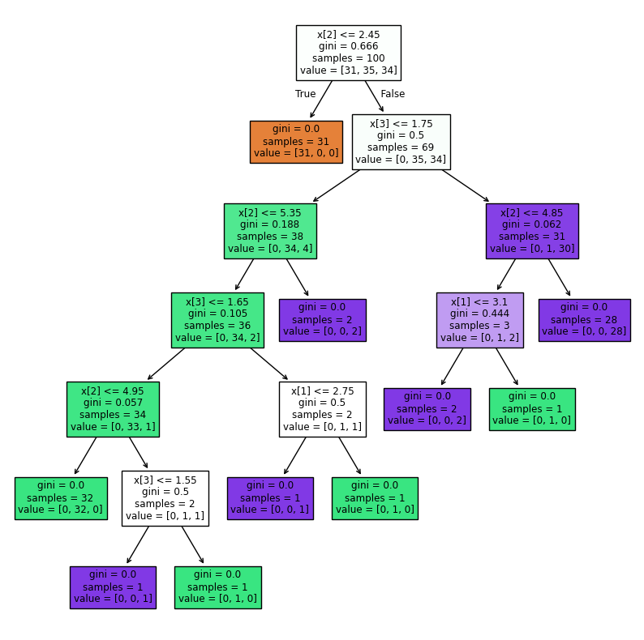
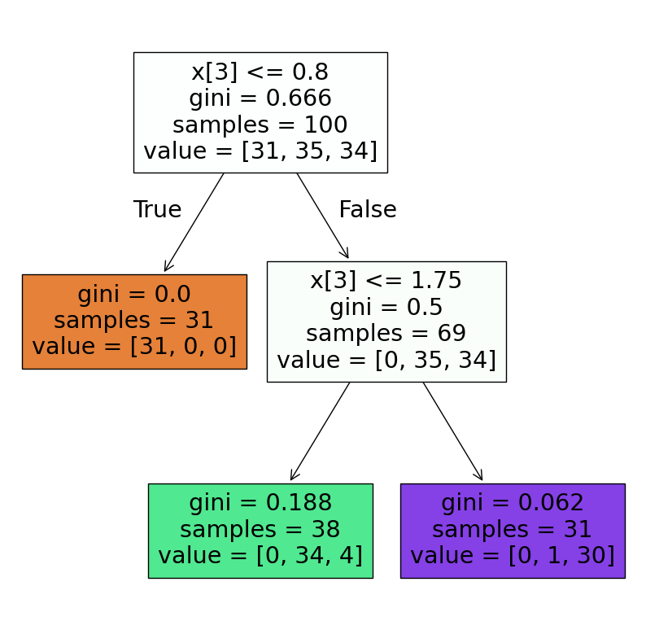

# 🌳 Decision Tree Classifier (with Post-Pruning)

Decision Tree Classifier is a **supervised learning algorithm** used for **classification tasks**.  
It works by splitting the dataset into regions based on **feature thresholds** and assigning the **most common class label** within each region as the prediction.  

This implementation includes **Post-Pruning**, a technique to reduce overfitting and improve the model’s ability to generalize on unseen data.  

---

## 🧠 Intuition

The core idea is to recursively **partition the feature space** such that the impurity of the target classes within each region is minimized.  

- At each node, the algorithm chooses the **best feature and threshold** that minimizes impurity.  
- The dataset is split recursively, forming a **tree structure**.  
- Predictions are made at the **leaf nodes** by taking the **majority vote** of samples in that region.  

However, a fully grown tree often **overfits the training data**.  
To counter this, **Post-Pruning** is applied:  
- The tree is first grown fully.  
- Then branches that do not provide significant predictive power are **removed** using metrics like validation accuracy or cost-complexity pruning.  

---

## 📊 Hypothesis Function

For a sample $x$, the prediction is:

`h(x) = majority_class(R_t)`

Where:
- `R_t` = region (leaf node) containing x
  
- `majority_class(R_t)` = the most frequent class label in that region

---

## ⚙️ Cost Function (Objective)

The objective is to minimize **impurity** at each split.  
For classification, impurity is measured using:  

1. **Gini Index**:

$$
Gini(t) = 1 - \sum_{k=1}^{K} p_{k}^2
$$  

3. **Entropy**:  

$$
Entropy(t) = - \sum_{k=1}^{K} p_{k} \log_2(p_{k})
$$  

Where:  
- $K$ = number of classes  
- $p_{k}$ = proportion of class $k$ in node $t$  

---

## ✂️ Post-Pruning

**Post-Pruning** is applied after the full tree is grown. It helps prevent **overfitting** by removing unnecessary branches.  

### Methods of Post-Pruning:
1. **Reduced Error Pruning (REP)**  
   - Remove branches if pruning does not reduce validation accuracy.  

2. **Cost-Complexity Pruning (CCP)**  
   - Introduces a penalty for complexity (depth, number of nodes).  
   - Objective:
     
  $R_\alpha(T) = R(T) + \alpha |T|$

   
   Where:  
   - $R(T)$ = misclassification error of the tree  
   - $|T|$ = number of leaf nodes  
   - $\alpha$ = penalty parameter controlling tree size  

---

## 📈 Visualization and Terminologies

- **Root Node** – top-most split  
- **Internal Nodes** – further splits based on conditions  
- **Leaf Nodes** – final class predictions (majority class)  
- **Post-Pruning** – branches are cut if they don’t improve validation accuracy  

---

## 🌲 Before vs After Pruning

### 🔹 Full (Unpruned) Decision Tree

- **Train Accuracy:** `1.00`  
- **Test Accuracy:** `0.87`  

The tree fits the training data perfectly (100% accuracy) but performs poorly on unseen test data → **overfitting**.

---

### 🔹 Post-Pruned Decision Tree

- **Train Accuracy:** `0.96`  
- **Test Accuracy:** `0.94`  

After pruning, the tree becomes simpler, slightly reducing train accuracy but **significantly improving test accuracy** → **better generalization**.

---

## 📊 Final Accuracy Metrics

- **Accuracy (Train):** `0.96`  
- **Accuracy (Test):** `0.94`  
- **Precision:** `0.93`  
- **Recall:** `0.94`  
- **F1 Score:** `0.94`  

---

## ✅ Key Takeaways

- Decision Trees classify data by recursive splitting.  
- Without pruning → risk of **overfitting**.  
- With **Post-Pruning** → model becomes **simpler, interpretable, and generalizes better**.  
- A small reduction in training accuracy often leads to **much better test performance**.  

---
