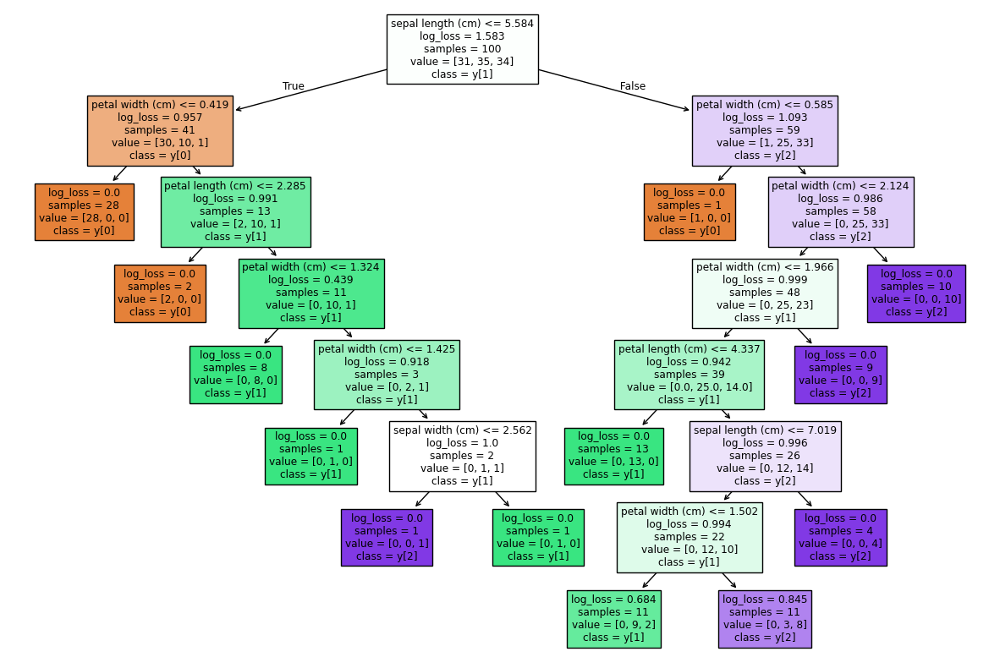

# 🌳 Decision Tree Classifier (with Pre-Pruning) 

Decision Tree Classifier is a **supervised learning algorithm** used for **classification tasks**.  
It works by splitting the dataset into regions based on **feature thresholds** and assigning the **most common class label** within each region as the prediction.  

This implementation includes **Pre-Pruning**, a technique to reduce overfitting during the training phase itself by restricting tree growth.  

---

## 🧠 Intuition

The core idea is to recursively **partition the feature space** such that the impurity of the target classes within each region is minimized.  

- At each node, the algorithm chooses the **best feature and threshold** that minimizes impurity.  
- The dataset is split recursively, forming a **tree structure**.  
- Predictions are made at the **leaf nodes** by taking the **majority vote** of samples in that region.  

However, if the tree is grown too deep, it may **overfit** the training data.  
To counter this, **Pre-Pruning** is applied:  
- Stop splitting when a condition (like max depth, min samples per leaf, or impurity threshold) is met.  
- This prevents unnecessary complexity **while training**.  

---

## 📊 Hypothesis Function

For a sample `x`, the prediction is:

`h(x) = majority_class(R_t)`

Where:  
- `R_t` = region (leaf node) containing `x`  
- `majority_class(R_t)` = the most frequent class label in that region  

---

## ⚙️ Cost Function (Objective)

The objective is to minimize **impurity** at each split.  
For classification, impurity is measured using:  

1. **Gini Index**:  

2. **Entropy**:  

Where:  
- `K` = number of classes  
- `p_k` = proportion of class `k` in node `t`  

---

## ✂️ Pre-Pruning

**Pre-Pruning** restricts the growth of the tree **while training** by applying stopping criteria.  
This helps to prevent **overfitting** and reduce computational cost.  

### Methods of Pre-Pruning:
1. **Maximum Depth Constraint**  
   - Stop splitting if the current depth exceeds a predefined limit.  

2. **Minimum Samples per Split/Leaf**  
   - Do not split a node if it has fewer than a set number of samples.  

3. **Impurity Threshold**  
   - Stop splitting if impurity is already below a given threshold.  

---
  
## Pre-Pruned Decision Tree

- **Train Accuracy:** `0.94`  
- **Test Accuracy:** `0.92`  

After applying pre-pruning constraints, the tree is smaller and generalizes better, achieving higher test accuracy.  

---

## 📊 Final Accuracy Metrics

- **Accuracy (Train):** `0.94`  
- **Accuracy (Test):** `0.92`  
- **Precision:** `0.91`  
- **Recall:** `0.92`  
- **F1 Score:** `0.91`  

---

## ✅ Key Takeaways

- Decision Trees classify data by recursive splitting.  
- Without pruning → risk of **overfitting**.  
- With **Pre-Pruning** → tree growth is restricted early, making the model **simpler and efficient**.  
- Often, pre-pruned trees achieve a **good balance between bias and variance**.  

---
