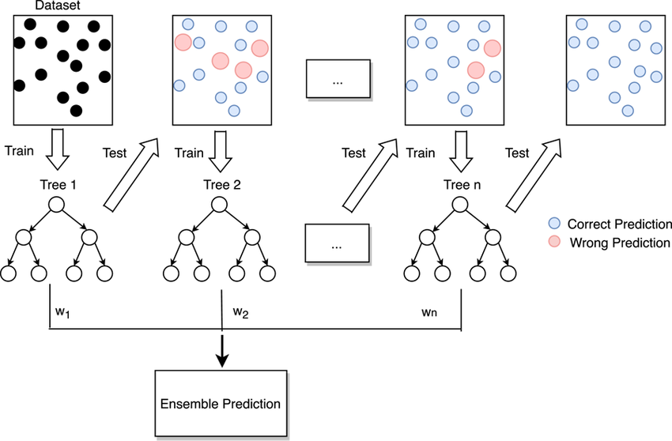

📘 Gradient Boosting Classifier

**Gradient Boosting Classifier** is an **ensemble learning algorithm** used for **classification tasks**.  
It builds a strong classifier by **combining multiple weak learners** (typically decision trees) in a **sequential manner**, where each new model corrects the mistakes of the previous ones.  

Unlike AdaBoost, Gradient Boosting minimizes the **loss function directly using gradient descent**, allowing it to optimize complex, differentiable loss functions.

---

## Intuition

The main idea is to **add models sequentially**, each new model focusing on the **residual errors (misclassifications)** of the previous models.  
Instead of re-weighting samples (as AdaBoost does), Gradient Boosting computes the **negative gradient of the loss function** and fits new learners to this gradient.  

The final classifier is formed by **aggregating the weighted predictions** from all the weak learners.

---

## Model Structure

Gradient Boosting for classification works as follows:

1. Start with an initial model (often based on log odds for binary classification).  
2. Compute **pseudo-residuals** — representing the gradient of the loss function.  
3. Train a weak learner on these pseudo-residuals.  
4. Compute the optimal weight (step size) for the learner.  
5. Update the model’s predictions by adding the scaled learner outputs.  
6. Repeat steps 2–5 for multiple iterations.

The final classifier combines all weak learners into a **strong ensemble model**.

---

## Loss Function

For classification, Gradient Boosting commonly uses the **logistic (deviance) loss function**, especially for binary classification:

$$
L(y, \hat{y}) = \sum_{i=1}^{m} \log(1 + e^{-y_i \hat{y}_i})
$$

Where:  
- \( y_i \in \{-1, +1\} \) = actual class label  
- \( \hat{y}_i \) = model’s predicted score (before applying sigmoid)  
- \( m \) = total number of training samples  

The algorithm minimizes this loss using **gradient descent**, fitting each new learner to the **negative gradient** of this function.

---

## Training Process

At each iteration \( t \):

1. Compute pseudo-residuals:
2. 
   $$
   r_i^{(t)} = -\frac{\partial L(y_i, F_{t-1}(x_i))}{\partial F_{t-1}(x_i)}
   $$
   
4. Fit a weak learner  \( h_t(x) \) to the pseudo-residuals \( r_i^{(t)} \).
5. Compute the optimal step size \( \gamma_t \):
   
   $$
   \gamma_t = \arg\min_\gamma \sum_{i=1}^{m} L(y_i, F_{t-1}(x_i) + \gamma \cdot h_t(x_i))
   $$
   
7. Update the model:
   
   $$
   F_t(x) = F_{t-1}(x) + \eta \cdot \gamma_t \cdot h_t(x)
   $$
   
   where \( \eta \) is the **learning rate** controlling the contribution of each tree.
9. Convert model scores to probabilities using the **sigmoid function**:

   $$
   P(y=1|x) = \frac{1}{1 + e^{-F_T(x)}}
   $$

The final class prediction is:

$$
\hat{y} = 
\begin{cases} 
1, & \text{if } P(y=1|x) > 0.5 \\
0, & \text{otherwise}
\end{cases}
$$

---

## Visualization

- Each weak learner corrects the **classification errors** of the previous models.  
- Predictions are combined using **gradient-based optimization**.  
- The model improves **sequentially** with each iteration.

---

## Accuracy

The following graph shows the accuracy and classification performance of the implemented Gradient Boosting Classifier model:

