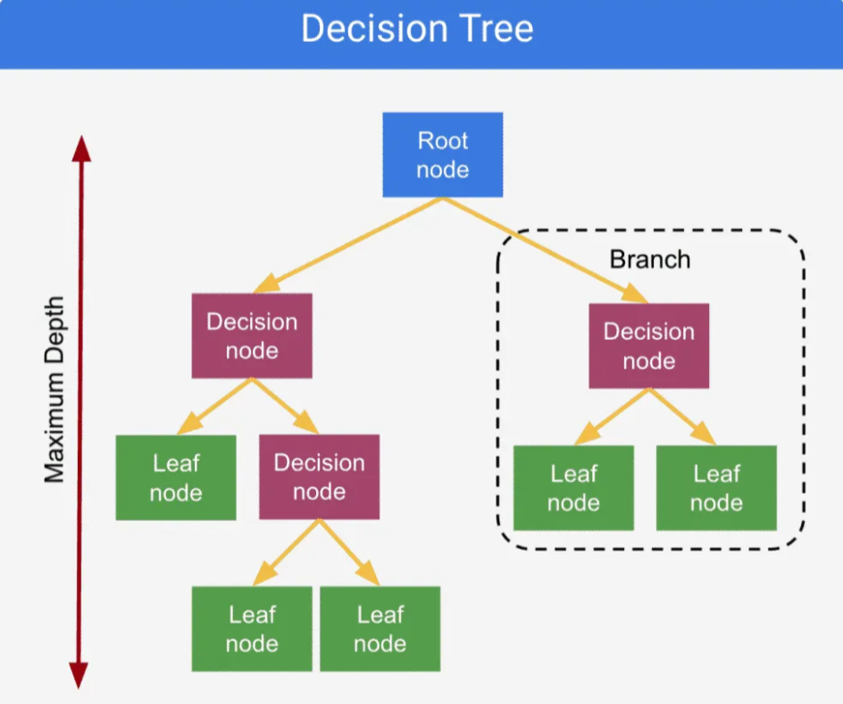
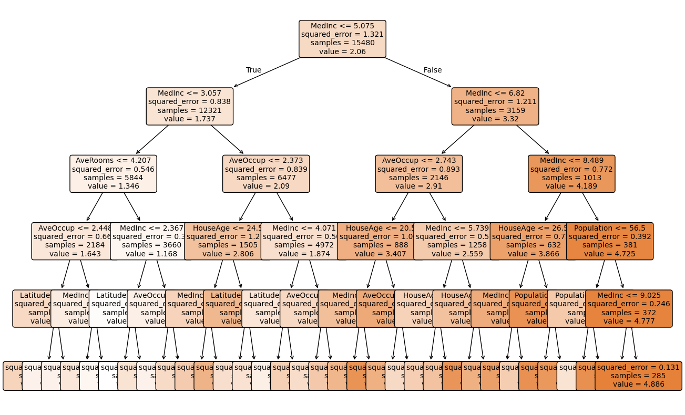

# 🌳 Decision Tree Regression

Decision Tree Regression is a type of **supervised learning algorithm** used for regression tasks.  
Unlike linear models, Decision Trees split the data into **regions based on feature thresholds** and predict the **mean value** of the target in each region.  
This makes them powerful for capturing **non-linear relationships** between input features and continuous outputs.

---

## 🧠 Intuition

The core idea is to **partition the feature space** into smaller regions such that the variance of the target values within each region is minimized.  

- At each node, the algorithm chooses the **best feature and threshold** that minimizes prediction error.  
- The dataset is split recursively, forming a tree structure.  
- Final predictions are made at the **leaf nodes** by taking the mean of the target values in that region.  

---

## 📊 Hypothesis Function

For Decision Tree Regression, the prediction for a sample $x$ is:

$$
h(x) = \frac{1}{N_t} \sum_{i \in R_t} y_i
$$

Where:
- $R_t$ = region of the leaf node containing $x$  
- $N_t$ = number of samples in that region  
- $y_i$ = target values of samples in that region  

---

## ⚙️ Cost Function (Objective)

The objective is to split the data such that the **Mean Squared Error (MSE)** is minimized.  

For a node $t$, the impurity is:

$$
MSE(t) = \frac{1}{N_t} \sum_{i \in R_t} (y_i - \bar{y_t})^2
$$

Where:
- $N_t$ = number of samples in node $t$  
- $\bar{y_t}$ = mean of target values in node $t$  

The split is chosen to minimize the weighted average of the child node impurities.

---

## 🔄 Splitting Process

1. For each feature, evaluate all possible thresholds.  
2. Compute the **reduction in MSE** for each split.  
3. Select the split with the **maximum error reduction**.  
4. Repeat recursively until stopping criteria are met (e.g., max depth, min samples per leaf).  

---

## 📈 Visualization and Terminologies

- Each **rectangle** (node) corresponds to a region of feature space.  
- Splits are made based on threshold conditions (e.g., $x_j \leq t$).  
- Predictions in the leaf nodes are the **mean target values** of that region.  
- The tree recursively partitions the data until constraints are met.  

---

## 🌲 Implementation’s Decision Tree

Below is the visualization of the trained Decision Tree (with `max_depth=5`) on the California Housing dataset:

---

## 📊 Accuracy

The model was trained and evaluated using **70% training** and **30% testing** data.  

- **Mean Squared Error (MSE):** `0.5210`  
- **Mean Absolute Error (MAE):** `0.5276`  
- **R² Score (Test):** `0.6030`  
- **Train R² Score:** `0.6321`

These results show that the model captures around **60% of the variance** in the housing prices, with a small gap between training and testing performance, indicating **good generalization**.

---
