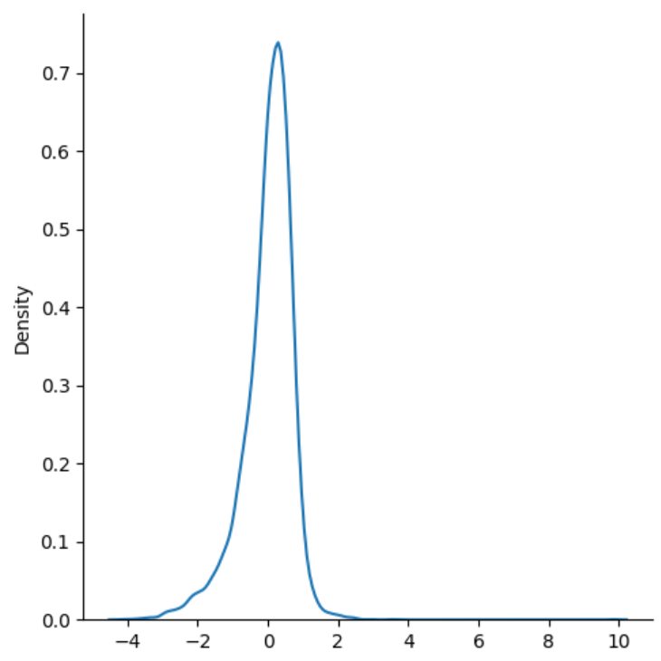

# 📘 Lasso Regression

Lasso Regression (also known as **L1 Regularization**) is a variant of **Linear Regression** that introduces a **penalty term** to reduce overfitting.  
It is particularly useful when we want to perform **feature selection**, as it can shrink some coefficients **exactly to zero**.  

---

##  Intuition

The main idea is to **shrink coefficients** by adding a penalty proportional to their **absolute magnitude**.  
This makes the model not only control complexity but also eliminate unnecessary features.  

For **Lasso Regression**:

$$
h_\theta(x) = \theta_0 + \theta_1 x_1 + \theta_2 x_2 + ... + \theta_n x_n
$$

But unlike Linear Regression, the cost function includes an **L1 regularization term**.

---

##  Cost Function

The Lasso Regression cost function is:

$$
J(\theta) = \frac{1}{2m} \sum_{i=1}^{m} (h_\theta(x^{(i)}) - y^{(i)})^2 + \lambda \sum_{j=1}^{n} |\theta_j|
$$

Where:
- $m$ = number of training examples  
- $h_\theta(x^{(i)})$ = predicted value  
- $y^{(i)}$ = actual value  
- $\lambda$ = regularization parameter (controls penalty strength)  
- $\theta_j$ = model parameters (excluding $\theta_0$)   

⚠️ Note: Larger \(\lambda\) → stronger regularization → more coefficients shrink to zero.

---

##  Gradient Descent

Unlike Ridge Regression, the gradient for Lasso is not differentiable at zero.  
The update rule involves **sub-gradient descent**:

$$
\theta_j := \theta_j - \alpha \left( \frac{1}{m} \sum_{i=1}^{m} (h_\theta(x^{(i)}) - y^{(i)})x_j^{(i)} + \lambda \cdot sign(\theta_j) \right)
$$

Where:

- $\alpha$ = learning rate  
- $sign(\theta_j)$ = returns +1 if $\theta_j > 0$, -1 if $\theta_j < 0$, and 0 if $\theta_j = 0$  

This property allows Lasso to set coefficients **exactly to zero**, performing feature selection.  

---

##  Visualization

- Lasso regression reduces both **variance** and **irrelevant features**.  
- It is useful when we suspect that only a subset of features are important.  

---

##  Accuracy

The following graph shows the accuracy of the implemented Lasso Regression model:

  
