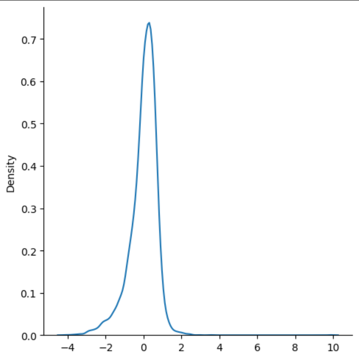

# 📘 Linear Regression

Linear Regression is one of the simplest and most widely used **supervised machine learning algorithms**.  
It establishes a **linear relationship** between the dependent variable (target `y`) and one or more independent variables (features `x`).  

---

##  Intuition

The main idea is to **fit a straight line** through the data points that best represents the relationship between input `X` and output `Y`.

For **Simple Linear Regression** (one feature):

$$
h_\theta(x) = \theta_0 + \theta_1 x
$$

For **Multiple Linear Regression** (multiple features):

$$
h_\theta(x) = \theta_0 + \theta_1x_1 + \theta_2x_2 + ... + \theta_nx_n
$$

---

##  Cost Function

We use **Mean Squared Error (MSE)** to measure how well our hypothesis fits the data:

$$
J(\theta) = \frac{1}{2m} \sum_{i=1}^{m} (h_\theta(x^{(i)}) - y^{(i)})^2
$$

Where:
- $m$ = number of training examples  
- $h_\theta(x^{(i)})$ = predicted value  
- $y^{(i)}$ = actual value  

---

##  Gradient Descent

To minimize the cost function, we use **Gradient Descent**:

$$
\theta_j := \theta_j - \alpha \frac{\partial}{\partial \theta_j} J(\theta)
$$

For Linear Regression:

$$
\theta_0 := \theta_0 - \alpha \frac{1}{m} \sum_{i=1}^{m} (h_\theta(x^{(i)}) - y^{(i)})
$$

$$
\theta_1 := \theta_1 - \alpha \frac{1}{m} \sum_{i=1}^{m} (h_\theta(x^{(i)}) - y^{(i)})x^{(i)}
$$

Where:
- $$\alpha$$ = learning rate

---

##  Visualization

The line tries to minimize the distance between predictions and actual points.

---

##  Accuracy

The following graph shows the accuracy of the implemented Linear Regression model:

