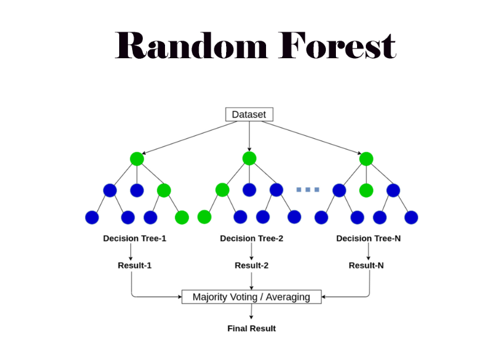
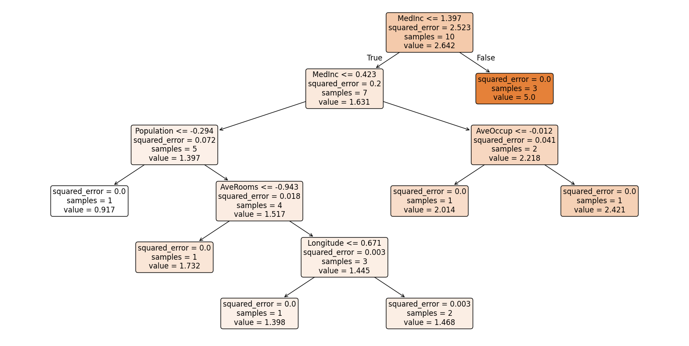
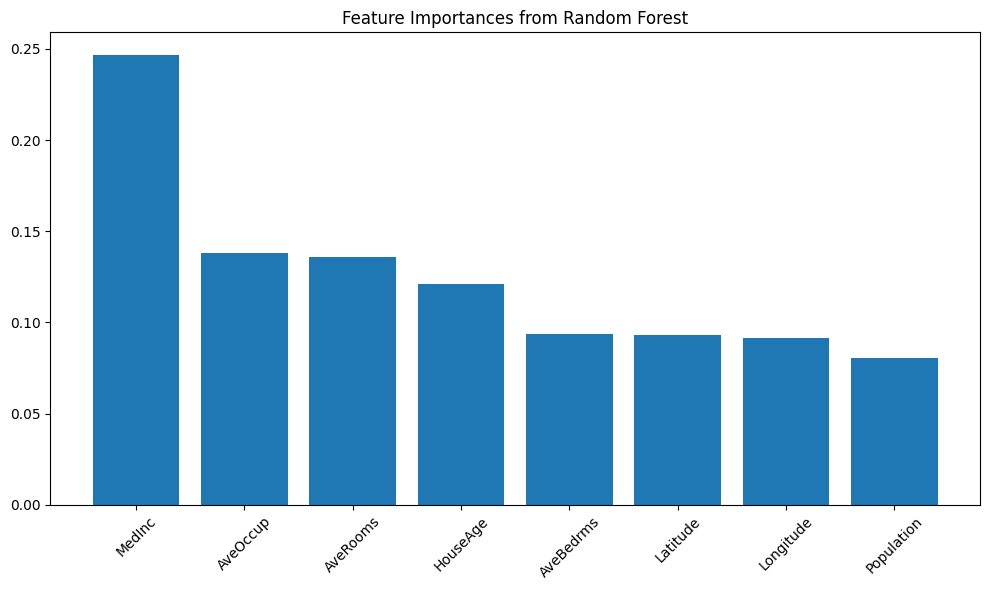

# 🌲🌲 Random Forest Regression

Random Forest Regression is an **ensemble learning method** that combines multiple **Decision Trees** to improve predictive performance.  
Instead of relying on a single tree, Random Forest averages the predictions of many trees, reducing variance and improving generalization.  

---

## 🧠 Intuition

- A **Decision Tree** is prone to overfitting when it grows deep.  
- **Random Forest** creates multiple trees, each trained on a random subset of the dataset and features.  
- By averaging their predictions, Random Forest produces a **robust and stable model** that reduces the risk of overfitting.  

---

## 📊 Hypothesis Function

The prediction for a sample $x$ is the **average of predictions from all trees**:

$$
h(x) = \frac{1}{T} \sum_{t=1}^{T} h_t(x)
$$

Where:  
- $T$ = total number of trees  
- $h_t(x)$ = prediction from the $t$-th tree  

---

## ⚙️ Cost Function (Objective)

Random Forest optimizes the **Mean Squared Error (MSE)** for regression:  

$$
MSE = \frac{1}{N} \sum_{i=1}^{N} (y_i - \hat{y_i})^2
$$

Where:  
- $y_i$ = actual target value  
- $\hat{y_i}$ = predicted target value  
- $N$ = number of samples  

The ensemble reduces variance compared to a single decision tree.  

---

## 🔄 Working of Random Forest

1. **Bootstrap Sampling or Row Sampling** – Random subsets of the training data are created with replacement.  
2. **Feature Randomness or Feature Sampling or Column Sampling** – At each split, only a random subset of features is considered.  
3. **Tree Training** – Each tree is trained independently.  
4. **Prediction** – For regression, predictions are averaged across all trees.  

---

## 📈 Visualization and Terminologies

- Each tree is trained on a **different random sample** of data.  
- At each node, a **random subset of features** is chosen for splitting.  
- Predictions from all trees are **averaged** to give the final output.  

---

## 🌲 Implementation’s Random Forest

Below is the visualization of a single Decision Tree of the Random Forest:

---

## 📊 Feature Importance Graph

Random Forest also provides **feature importance scores**, showing which features have the most influence on predictions.  

- The higher the bar, the more important the feature is in making predictions.  
- Helps in **interpretability** and **feature selection** for future models.  

---

## ✅ Advantages of Random Forest

- Handles **non-linear relationships** well.  
- More **robust** than a single Decision Tree.  
- Reduces **variance** and prevents overfitting.  
- Works well even with **high-dimensional data**.  

---

## ⚠️ Limitations

- Computationally **more expensive** (many trees).  
- Less interpretable compared to a single decision tree.  
- May require **tuning** (e.g., number of trees, max depth) for optimal performance.  

---
