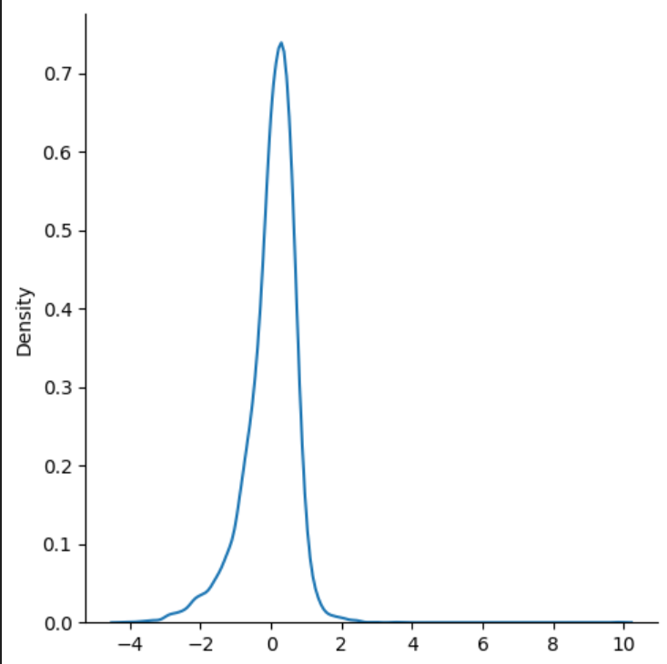

# 📘 Ridge Regression

Ridge Regression (also known as **L2 Regularization**) is a variant of **Linear Regression** that introduces a **penalty term** to reduce overfitting.  
It helps when data has **multicollinearity** (high correlation between features) or when we want to control model complexity.  

---

##  Intuition

The main idea is to **shrink coefficients** by adding a penalty proportional to their magnitude (squared).  
This prevents coefficients from becoming too large, improving generalization.

For **Ridge Regression**:

$$
h_\theta(x) = \theta_0 + \theta_1 x_1 + \theta_2 x_2 + ... + \theta_n x_n
$$

But unlike Linear Regression, the cost function includes a **regularization term**.

---

##  Cost Function

The Ridge Regression cost function is:

$$
J(\theta) = \frac{1}{2m} \sum_{i=1}^{m} (h_\theta(x^{(i)}) - y^{(i)})^2 + \lambda \sum_{j=1}^{n} \theta_j^2
$$

Where:
- $m$ = number of training examples  
- $h_\theta(x^{(i)})$ = predicted value  
- $y^{(i)}$ = actual value  
- $\lambda$ = regularization parameter (controls penalty strength)  
- $\theta_j$ = model parameters (excluding $\theta_0$)   

⚠️ Note: Larger \(\lambda\) → stronger regularization → smaller coefficients.

---

##  Gradient Descent

To minimize the cost function, the update rule becomes:

$$
\theta_j := \theta_j - \alpha \left( \frac{1}{m} \sum_{i=1}^{m} (h_\theta(x^{(i)}) - y^{(i)})x_j^{(i)} + \lambda \theta_j \right)
$$

Where:

- $\alpha$ = learning rate  
- The term $\lambda \theta_j$ applies the shrinkage.
---

##  Visualization

- Ridge regression reduces the **variance** of the model at the cost of introducing a small **bias**.  
- It prevents overfitting by shrinking coefficients.

---

##  Accuracy

The following graph shows the accuracy of the implemented Ridge Regression model:

